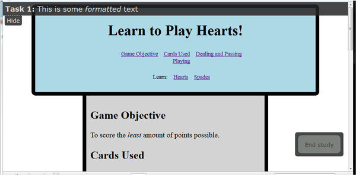

##Server status
The http://staff.washington.edu/rbwatson server has been updated to this repo as  of 4/20/2013 @ 16:00pm.

The wlux_test_server code runs on http://staff.washington.edu/rbwatson and is used to test server-side code while we're experimenting with WebLabUX utilities and "plumbing." I'll make sure that what is in the master repo is also on the server.

To run the demo, go to http://staff.washington.edu/rbwatson/start.php 

##Release notes
**THIS BUILD IS NOT READY FOR RELEASE -- IT IS FOR TESTING/DEMO ONLY **
When ready for production, the javascript needs to be compiled / minified so that it
will download and run faster on client sites. This can be done using the google closure 
compiler (compiler.jar), via the following command:

   java -jar compiler.jar --js jquery.js --js wlux_instrumentation.js --js_output_file wlux_instrumentation.min.js

This also combines jquery and wlux_instrumentation into a single file. Now test sites need 
only include a single script, `wlux_instrumentation.min.js`.

To avoid having to copy/paste or memorize this command, there are two scripts `compile.sh` and
`compile.bat` which will run the minification command on linux and windows, respectively.

## Study config data object
The study config data object passes data from the WebLabUX server to the site/page being tested 
so the WLUX_Instrumentation.js file can configure the page layout for the study session in progress. 
The data is passed as a jsonp object and currently contains these fields. The nature of this design, however,
is to allow this object to be updated as necessary so, confirm these fields with the actual payload.

| Data field | Description |
|--------------|------------------------------------------------------------------| 
| *conditionId* | the condition ID of the current session -- used by logger calls |
| *cssURL* | The URL of the CSS to use for the current session -- This is usually a .css file on the WebLabUX server that is associated with the study. |
| *taskBarCSS* | The URL of the CSS to use for the taskBar -- This is usually configured so the task bar affordances don't interfere with pages on the study site. |
| *buttonText* | the text to display on the task button. -- Usually something like "End Task" or "End study." |
| *returnURL* | the URL to the return page in WebLabUX. -- This is typically the post-study questionnaire, but could be configured to point to the next task in a multi-task study. |
| *taskText* | The unformatted text to display in the task bar. |
| *taskHTML* | Formatted HTML to display in the task bar. If both this field and the *taskText* are defined, only this field will be used. |
| *tabShowText* | Text to display in the show/hide task button when the task bar is hidden. |
| *tabHideText* | Text to display in the show/hide task button when the taks bar is visible. |

### Styles used by the taskBarCSS file
The taskBarCSS file referenced in the study config data object uses the styles shown here to configure the task bar and  task/study end button.

## Data logger data object
The logger data object is defined by the structure in WLUX_Instrumentation.js and has two flavors: **open** and **transition**.
Because these structures are defined in the code, confirm the fields as they are defined in the POST request to logger.php.

| Data field | Open | Transition | Description |
|--------------|---|---|------------------------------------------------------------------| 
| *a_class* |  | X | The value of the **class** attribute of the link, if one is defined. |
| *a_id*	|  | X | The value of the **id** attribute of the link, if one is defined. |
| *conditionId* | X | X | The condition ID for the current session - received from WebLabUX in the study config data. |
| *from* |  | X | The URL of the page that contains the link that was clicked. |
| *to* |  | X | The URL of the link target (destination) page. |
| *type* | X | X | The type of record being sent: **transition** or **open** |
| *wlux_session* | X | X | The session ID for the current session - received from WebLabUX in the study config data. |

